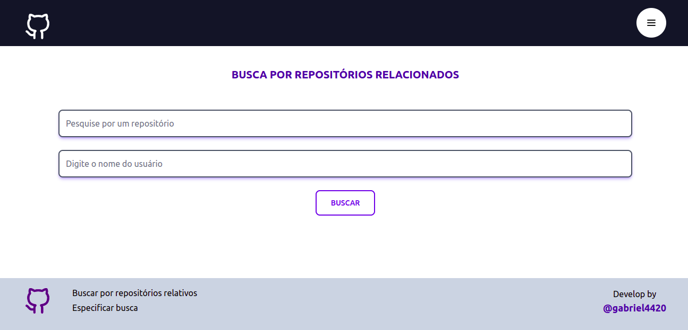
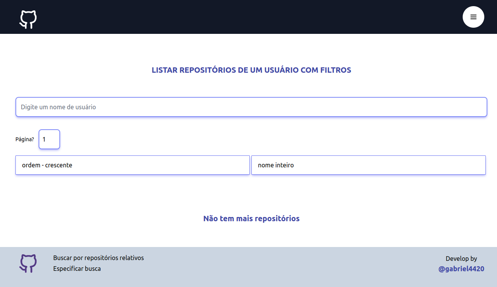

<div align="center" id="top"> 
  
  &#xa0;
  
  
</div>

<h1 align="center">Github Searchings</h1>

<p align="center">
  

  

  

  

</p>

<p align="center">
  <a href="#dart-sobre">Sobre</a> &#xa0; | &#xa0; 
  <a href="#sparkles-funcionalidades">Funcionalidades</a> &#xa0; | &#xa0;
  <a href="#rocket-tecnologias">Tecnologias</a> &#xa0; | &#xa0;
  <a href="#white_check_mark-pré-requisitos">Pré requisitos</a> &#xa0; | &#xa0;
  <a href="#checkered_flag-começando">Começando</a> &#xa0; | &#xa0;
  <a href="#memo-licença">Licença</a> &#xa0; | &#xa0;
  <a href="https://github.com/Gabriel4420" target="_blank">Autor</a>
</p>

<br>

## :dart: Sobre

Eu quero te desafiar a demonstrar algumas habilidades, desenvolvendo um app simples, que exiba a lista de seus próprios repositórios GITHUB usando a API Graphql pública do GITHUB, ou a API Rest pública do GITHUB. Essa listagem precisa conter:

## :sparkles: Funcionalidades

:heavy_check_mark: Funcionalidade de filtro por pelo menos 3 atributos (exemplo, exibir somente repositórios arquivados);\
:heavy_check_mark: Funcionalidade de ordenação alfabética e por data do ultimo commit;\
:heavy_check_mark: Funcionalidade de pesquisa simples (exemplo, pesquiso por "node" e vejo a lista de repositórios que possuem a string "node" em parte do nome;

## :rocket: Tecnologias

As seguintes ferramentas foram usadas na construção do projeto:

- [Axios](https://axios-http.com/ptbr/docs/intro)
- [Tailwindcss](https://tailwindcss.com/docs/installation)
- [styled-components](https://styled-components.com/docs)
- [React](https://pt-br.reactjs.org/)
- [phosphor-react](https://phosphoricons.com/)
- [postcss](https://postcss.org/)
- [autoprefixer](https://autoprefixer.github.io/)
- [TypeScript](https://www.typescriptlang.org/)

## :white_check_mark: Pré requisitos

Antes de começar :checkered_flag:, você precisa ter o [Git](https://git-scm.com) e o [Node](https://nodejs.org/en/) instalados em sua maquina.

## :checkered_flag: Começando

```bash
# Clone este repositório
$ git clone https://github.com/Gabriel4420/github-searchings


# Instale as dependências
$ yarn

# Para iniciar o projeto
$ yarn dev

# O app vai inicializar em <http://localhost:3000>
```

## :memo: Licença

Este projeto está sob licença MIT. Veja o arquivo [LICENSE](LICENSE.md) para mais detalhes.

Feito com :heart: por <a href="https://github.com/Gabriel4420" target="_blank">Gabriel Rodrigues Perez</a>

&#xa0;

<a href="#top">Voltar para o topo</a>
